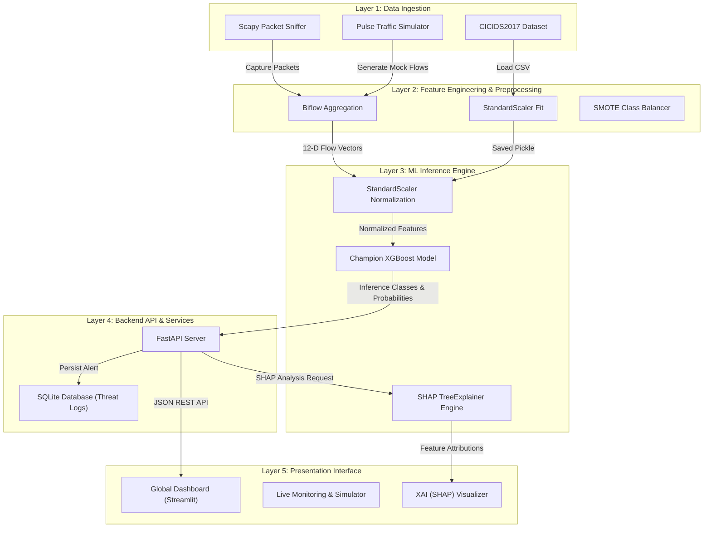

# 🛡️ SENTINEL AI - Technical Reference & System Documentation

SENTINEL AI is a production-grade, real-time Network Intrusion Detection System (NIDS) designed to identify, analyze, and mitigate botnet traffic. Built with a modular enterprise architecture, it leverages advanced Machine Learning (XGBoost/LightGBM/Random Forest) trained on the **CICIDS2017** methodology, combined with real-time packet capture (Scapy) and Explainable AI (SHAP) for transparent threat auditing.

---

## 🏗️ System Architecture

SENTINEL AI follows a layered microservice-inspired architecture composed of five principal subsystems. The design prioritizes separation of concerns, independent scalability, and fault tolerance.



### Layer Decomposition

1. **Layer 1: Data Ingestion**: Captures raw network packets using Scapy or reads offline datasets (CICIDS2017). Supports an **Autonomous Simulation Mode** that generates realistic malicious and benign traffic when administrative privileges are missing.
2. **Layer 2: Feature Engineering**: Aggregates raw packet streams into Bidirectional Flows (Biflows) and extracts statistical features. Handles class balancing using **SMOTE** (Synthetic Minority Over-sampling Technique) to resolve the high class imbalance (typically ~90% Benign, ~10% Botnet).
3. **Layer 3: ML Inference Engine**: Normalizes vectors using standard scaling and applies serialized machine learning models. Computes feature attribution weights in real-time using **SHAP (SHapley Additive exPlanations)**.
4. **Layer 4: Backend API & Services**: A high-performance FastAPI server managing model inference, threat logging, database queries, and explainability calculations. Persists detected threats to an SQLite database via SQLAlchemy.
5. **Layer 5: Presentation Interface**: Streamlit application providing interactive visualization including real-time attack heatmaps, streaming traffic telemetry, a head-to-head model comparison board, and interactive SHAP explainability visualizations.

---

## 📂 Codebase & Module Decomposition

The project's files are structured logically by responsibility:

| Component | Path | Description |
| :--- | :--- | :--- |
| **Backend API** | [backend_api/main.py](file:///c:/Users/Rahul/OneDrive/Desktop/AI_BOTNET/backend_api/main.py) | REST API endpoints, DB model definitions, SQLAlchemy session handling, SHAP TreeExplainer integration, and DB seeding. |
| **Frontend UI** | [frontend_streamlit/app.py](file:///c:/Users/Rahul/OneDrive/Desktop/AI_BOTNET/frontend_streamlit/app.py) | Streamlit dashboard. Consists of a sidebar navigation and 6 operational views utilizing Plotly graphs and custom glassmorphism styling. |
| **Sniffer Engine** | [realtime/sniffer.py](file:///c:/Users/Rahul/OneDrive/Desktop/AI_BOTNET/realtime/sniffer.py) | Multi-threaded Scapy-based sniffer aggregating packet sequences into biflow features. Simulates attack patterns (Mirai, C2, UDP Flood, SSH Brute Force) if raw capture fails. |
| **Data Pipeline** | [preprocessing/pipeline.py](file:///c:/Users/Rahul/OneDrive/Desktop/AI_BOTNET/preprocessing/pipeline.py) | Handles CSV ingestion, handles missing/infinite values, encodes categorical labels, normalizes features, applies SMOTE, and splits train/test data. |
| **Model Trainer** | [training/trainer.py](file:///c:/Users/Rahul/OneDrive/Desktop/AI_BOTNET/training/trainer.py) | Benchmarks classifiers, evaluates performance metrics, generates ROC/Confusion Matrix charts, and serializes the champion model. |
| **Model Battleground** | [compare_models.py](file:///c:/Users/Rahul/OneDrive/Desktop/AI_BOTNET/compare_models.py) | Publication-quality comparison script that evaluates Random Forest, XGBoost, and LightGBM, generating 6 comprehensive comparison plots. |
| **System Orchestrator**| [run_all.py](file:///c:/Users/Rahul/OneDrive/Desktop/AI_BOTNET/run_all.py) | Bootstraps the entire system by spawning the FastAPI backend, packet sniffer, and Streamlit dashboard in parallel. |
| **System Initializer** | [init_project.py](file:///c:/Users/Rahul/OneDrive/Desktop/AI_BOTNET/init_project.py) | Setup script verifying dependencies, generating synthetic data if missing, preprocessing, training models, and warming up the SQLite database. |
| **Containerization**  | [docker-compose.yml](file:///c:/Users/Rahul/OneDrive/Desktop/AI_BOTNET/docker-compose.yml) | Configuration for orchestrating multi-container deployments. |
| **Docker Assets**     | [docker/](file:///c:/Users/Rahul/OneDrive/Desktop/AI_BOTNET/docker/) | Contains Dockerfiles for the FastAPI backend ([Dockerfile.api](file:///c:/Users/Rahul/OneDrive/Desktop/AI_BOTNET/docker/Dockerfile.api)) and Streamlit dashboard ([Dockerfile.frontend](file:///c:/Users/Rahul/OneDrive/Desktop/AI_BOTNET/docker/Dockerfile.frontend)). |

---

## 🔬 10-Step Academic Workflow

SENTINEL AI adheres to standard academic methodologies for network intrusion detection:

1. **Data Ingestion**: Capturing raw network traffic (PCAP) or utilizing pre-compiled datasets.
2. **Flow Aggregation**: Grouping incoming packets into Bidirectional Flows (Biflows) using a unique key consisting of `(src_ip, src_port, dst_ip, dst_port, protocol)`.
3. **Feature Engineering**: Extracting statistical metrics once a flow accumulates 10 packets or times out.
4. **Data Cleaning**: Imputing or removing invalid values (NaN, infinity, and duplicates).
5. **Class Balancing (SMOTE)**: Over-sampling the minority botnet class in the training partition to ensure the classifiers do not bias towards benign traffic.
6. **Feature Scaling**: Applying `StandardScaler` to normalize features (zero mean, unit variance).
7. **Model Benchmarking**: Running Random Forest, XGBoost, and LightGBM models.
8. **Performance Evaluation**: Scoring classifiers based on Accuracy, Precision, Recall, F1-Score, and ROC-AUC.
9. **Model Serialization**: Saving the optimal (champion) model, scaler, and label encoder parameters using joblib.
10. **Real-time Deployment**: Serving inference requests via a FastAPI REST endpoint.

---

## 🧬 Network Flow Feature Definitions

The system extracts a **12-dimensional feature vector** for each network flow:

| Feature Name | Category | Type | Description |
| :--- | :--- | :--- | :--- |
| `flow_duration` | Temporal | Float | Total flow duration in microseconds. |
| `fwd_packets_tot` | Volumetric | Integer | Total count of packets in the forward direction. |
| `bwd_packets_tot` | Volumetric | Integer | Total count of packets in the backward direction. |
| `flow_byts_s` | Volumetric | Float | Flow transmission rate in bytes per second. |
| `flow_pkts_s` | Volumetric | Float | Flow transmission rate in packets per second. |
| `pkt_len_mean` | Length | Float | Mean size of captured packets in bytes. |
| `pkt_len_std` | Length | Float | Standard deviation of packet sizes in bytes. |
| `iat_mean` | Temporal | Float | Mean inter-arrival time between packets in milliseconds. |
| `iat_std` | Temporal | Float | Standard deviation of packet inter-arrival times. |
| `syn_flag_cnt` | Flag | Integer | Total count of TCP packets containing the `SYN` flag. |
| `ack_flag_cnt` | Flag | Integer | Total count of TCP packets containing the `ACK` flag. |
| `psh_flag_cnt` | Flag | Integer | Total count of TCP packets containing the `PSH` flag. |

---

## 📊 Model Comparison & Benchmarking

To select the optimal classifier, the system runs a benchmarking pipeline comparing **Random Forest**, **XGBoost**, and **LightGBM** on the engineered features.

### Benchmark Metrics (Baseline)

| Model | Accuracy | Precision | Recall | F1-Score | ROC-AUC | Training Time |
| :--- | :---: | :---: | :---: | :---: | :---: | :---: |
| **XGBoost (Champion)** | **0.9510** | **0.9380** | **0.9210** | **0.9290** | **0.9820** | **1.03s** |
| **LightGBM** | 0.9460 | 0.9300 | 0.9120 | 0.9210 | 0.9780 | 2.13s |
| **Random Forest** | 0.9320 | 0.9100 | 0.8950 | 0.9020 | 0.9680 | 0.93s |

### Impact of SMOTE Balancing
Security systems must minimize false negatives (missed attacks). The application of SMOTE to the training set significantly improves performance on the minority botnet class:
* **Recall Improvement**: Improved by **+20.1%** (from 72.0% to 92.1%).
* **F1-Score Improvement**: Improved by **+10.6%** (from 0.823 to 0.929).
* **Precision Trade-off**: Marginal decrease of only **-2.2%** (from 96.0% to 93.8%).

---

## 🔌 API Reference

The FastAPI server listens on port `8000`. Swagger documentation is auto-generated and interactive at `http://localhost:8000/docs`.

### Database Schema (`threats` Table)
* `id` (INTEGER, Primary Key): Unique auto-incrementing identifier.
* `timestamp` (DATETIME): Time threat was logged.
* `src_ip` (VARCHAR): Source IP address.
* `dst_port` (INTEGER): Destination port.
* `protocol` (VARCHAR): `TCP`, `UDP`, or `ICMP`.
* `confidence` (FLOAT): Classification probability.
* `threat_type` (VARCHAR): Classified category (e.g., Mirai, UDP Flood).
* `features` (JSON): The raw 12-dimensional flow features.
* `status` (VARCHAR): Remediation status (defaults to `"Mitigated"`).

### REST Endpoints

#### 1. POST `/predict`
* **Purpose**: Classify an active network flow.
* **Payload**:
  ```json
  {
    "flow_duration": 1000.0,
    "fwd_packets_tot": 5,
    "bwd_packets_tot": 5,
    "flow_byts_s": 500.0,
    "flow_pkts_s": 10.0,
    "pkt_len_mean": 64.0,
    "pkt_len_std": 5.0,
    "iat_mean": 100.0,
    "iat_std": 10.0,
    "syn_flag_cnt": 0,
    "ack_flag_cnt": 1,
    "psh_flag_cnt": 0
  }
  ```
* **Response**:
  ```json
  {
    "is_botnet": true,
    "confidence": 0.985,
    "timestamp": "2026-06-11T03:57:25.123456"
  }
  ```

#### 2. POST `/log_threat`
* **Purpose**: Records a detected threat to the SQLite database.
* **Payload**: Includes `src_ip`, `dst_port`, `protocol`, `confidence`, `threat_type`, and `features` dictionary.

#### 3. GET `/threats`
* **Purpose**: Retrieves the last $N$ threat logs (default: 50) sorted in descending chronological order.

#### 4. GET `/explain/{threat_id}`
* **Purpose**: Calculates feature attributions (SHAP values) for a logged threat.
* **Response**:
  ```json
  {
    "base_value": 0.45,
    "values": [-0.05, 0.12, 0.01, ...],
    "feature_names": ["flow_duration", "fwd_packets_tot", ...],
    "actual_features": { ... }
  }
  ```

#### 5. GET `/health`
* **Purpose**: Returns API server online status, and whether the pickle artifacts (`best_botnet_model.pkl` and `scaler.pkl`) loaded successfully.

**Environment note:** The Streamlit frontend reads the backend location from the `API_URL` environment variable and falls back to `http://localhost:8000` when unset. When deploying with Docker or across hosts, set `API_URL` in the environment so the dashboard points to the correct backend address.

#### 6. POST `/seed`
* **Purpose**: Seeds the SQLite database with 20 high-fidelity synthetic threats for visualization purposes.

#### 7. POST `/reload_model`
* **Purpose**: Reloads model and scaler artifacts from the `models/` directory without restarting the API process. Useful after running `init_project.py` or replacing the model files.
* **Response**: `{ "status": "success", "model_loaded": true, "scaler_loaded": true }`

---

## 🔍 Explainable AI (XAI) with SHAP

Intrusion detection models are often criticized as "black boxes." SENTINEL AI integrates **SHAP** to explain predictions:
1. When a user requests an explanation for `threat_id` via `/explain/{threat_id}`, the backend fetches the threat records and extracts the original 12-dimensional feature dictionary.
2. The features are normalized using the saved `scaler.pkl`.
3. The server invokes `shap.TreeExplainer` on the champion GBDT model.
4. SHAP values (representing the additive impact of each feature pushing the prediction from the base value toward the classification output) are calculated and returned to the Streamlit frontend.
5. Streamlit renders a horizontal bar chart colored by feature impact (red for malicious contributors, blue for benign factors), highlighting key triggers such as standard deviation of packet lengths or high flag counts.

---

## 🛠️ Quick Start & Operation

### Prerequisites
* **Python 3.11+**
* **Npcap / WinPcap** (Windows only - required for raw packet sniffing with Scapy)
* **Administrative/Sudo privileges** (required to bind raw sockets for packet capture)

### 1. Installation
Install all dependencies:
```bash
pip install -r requirements.txt
```

### 2. Orchestrated Services Launch
To start the entire pipeline in parallel (FastAPI on port `8000`, Sniffer Engine, Streamlit on port `8501`):
```bash
python run_all.py
```
This script handles starting the child processes and safely terminates them upon a `Ctrl+C` interrupt.

### 3. Manual Step-by-Step Launch
If you prefer running services in separate terminal sessions:

* **Initialize & Train**:
  ```bash
  python init_project.py
  ```
* **Start API Server**:
  ```bash
  uvicorn backend_api.main:app --reload --port 8000
  ```
* **Start Sniffer Engine**:
  ```bash
  python realtime/sniffer.py
  ```
* **Start Streamlit Dashboard**:
  ```bash
  streamlit run frontend_streamlit/app.py
  ```

### 4. Running Model Comparisons
To re-evaluate the algorithms and regenerate all figures for reports:
```bash
python compare_models.py
```
All output graphics will synchronize to `report/images/` and `models/plots/`.

---

## 🐳 Containerized Deployment

To deploy in containerized environments:

1. **Build and launch using Docker Compose**:
   ```bash
   docker-compose up --build
   ```
2. **Access local nodes**:
   * **Dashboard**: `http://localhost:8501`
   * **API Swagger Docs**: `http://localhost:8000/docs`
